# Exercise 1: Creating tables for our travel request application

**Duration: 20 minutes**

## Introduction

In the first section, we will create two tables. Our first table will be used to capture the Travel Requests coming in from employees, and our second table will be used to store all the major airports and cities that can be traveled to. We will assume that all Travel Requests will only be for air travel.

## Let's start

1. Click **All**, then search and click **App Engine Studio**

    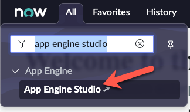

1. Click **Create app** on the top right of the screen

    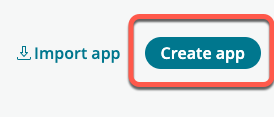

1. On the Create App page, name the app "Travel request", and for description, enter "Track travel requests from employees."

    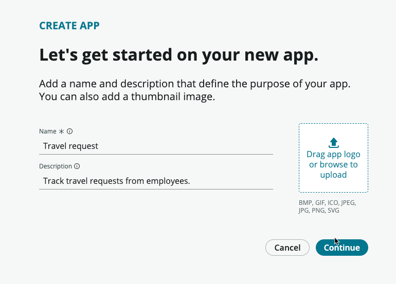

1. Click **Continue**

1. Leave the default roles - *admin* and *user*, and click **Continue**

1. Click **Go to app dashboard**

    > What you've just done is create a scoped application. Scope uniquely identifies every application file, not just within a single ServiceNow instance, but in every instance around the world. Why is this important?
    >- Scope protects an application, its files, and its data from conflicts with other applications.
    >- Scope determines which parts of an application are available for use by other applications in ServiceNow.
    >- Scope allows developers to configure which parts of their application can be acted on by other applications.
    >- Scope prevents work done in the main ServiceNow browser window (not in Studio) from becoming part of an application's files.
    >- Witout Scope, it will be very difficult to govern new applications!

## Create a Travel Request table

We will now create a table to capture the travel requests.

1. Under **Data**, click **Add**

    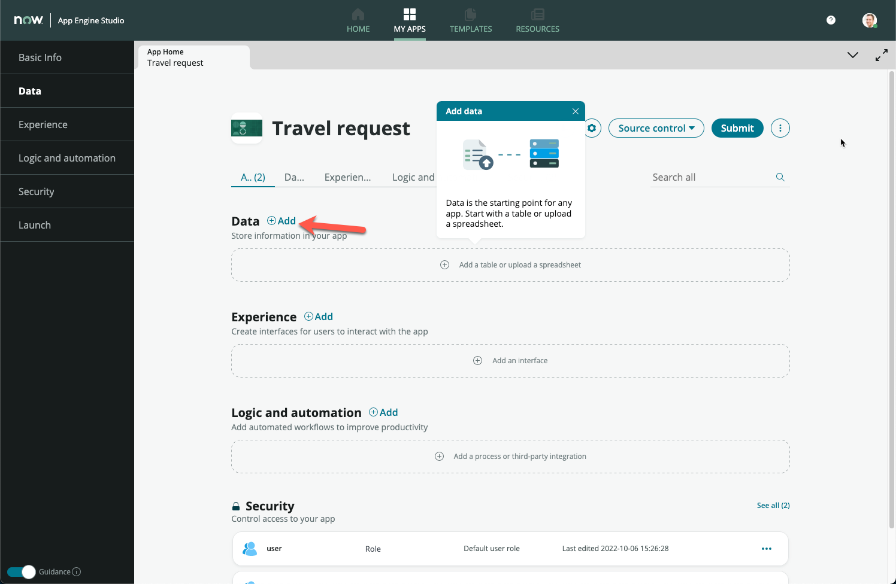

1. Click **Create a table**

1. Click **Get started**

1. On the *Add Data* page, click **Create from an existing table**

1. Click **Continue**

    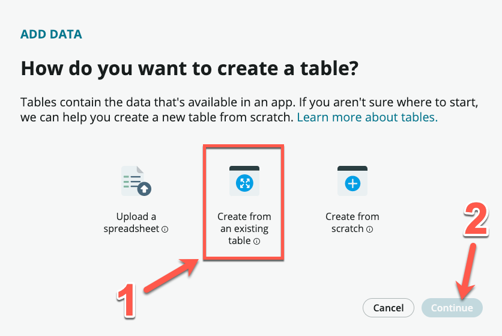

1. On the next page, search and select **Task**

    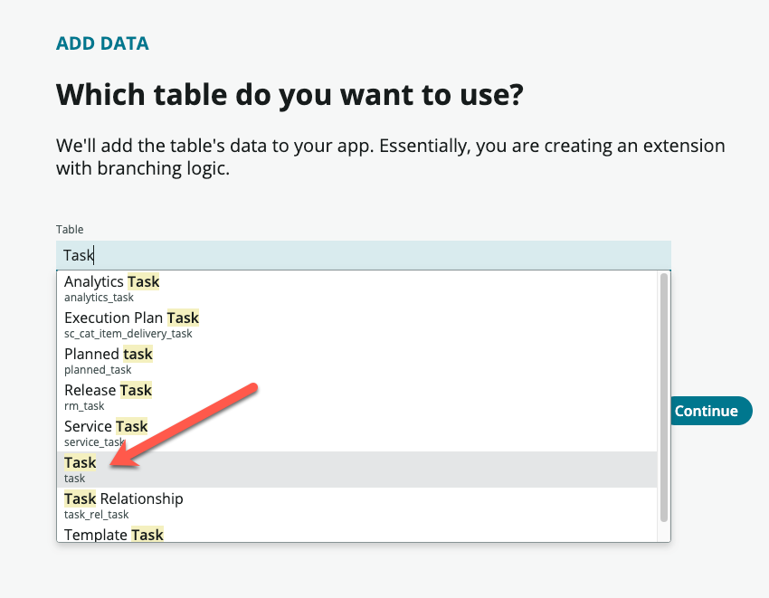

    >The task table is one of the core tables provided on the platform. Any table that extends task can take advantage of task-specific functionality such as SLAs and Approvals. This speeds up the overall process and ease of building logic and functionality.

1. Click **Continue**

1. For Table label, enter **Travel request**. Table name should be auto-populated.

1. Check **Auto number**

1. For Prefix, enter **TRVREQ**

    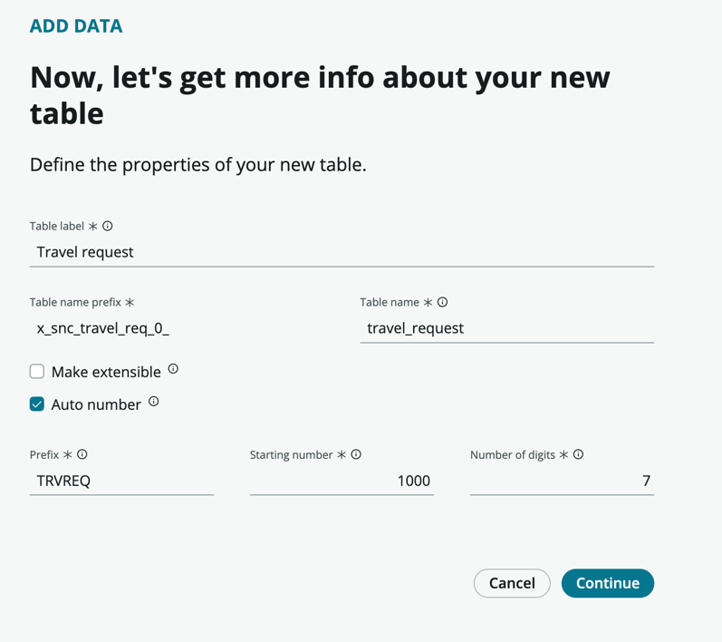

1. Click **Continue**

1. Allow all access for *admin* and **Create** and **Read** access for *user*

    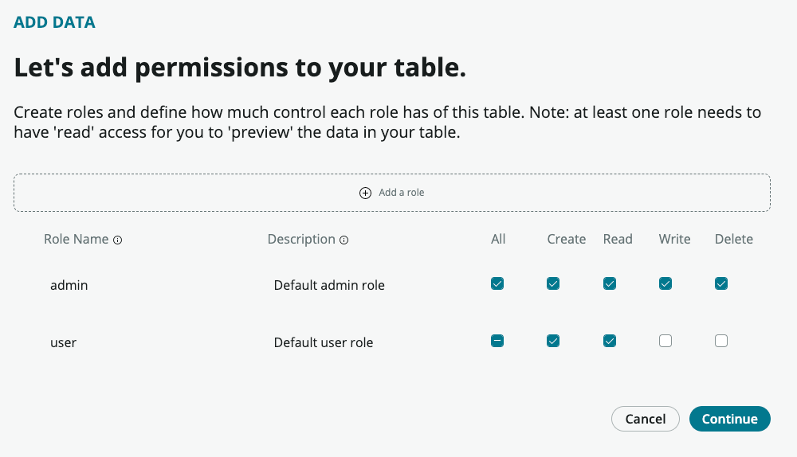

1. Click **Continue**

1. Click **Edit table**

1. If presented with the **Welcome to Table builder** pop-up, read through the steps, then close it.

1. You should now be on the *Table Builder* interface. Click **Add new field**, and add the following fields:

    Column label | Type
    -------------- | --------------
    Departure date | Date
    Return date | Date
    Estimated airfare | Decimal 
    Reason for travel | Choice (Dropdown with --None--) : **Internal meeting, Customer meeting, Training**

1. Click **Done**

1. Your screen should look like this

    

1. Click **Save**

    At this point, we could also capture the Origin and Destination via a String field so that the users can enter free text, but for more consistency, let's create an **Airports** table so that users can select these locations (like how you would select on any airline reservation website)

## Create an Airport table

1. Click the **App Home** tab to return to the main view

    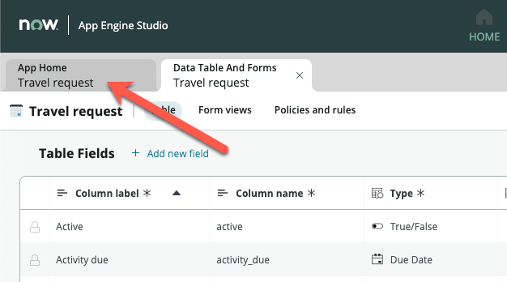

1. Under **Data**, click **Add**

    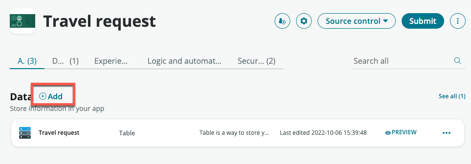

1. Click **Create a table**

1. Click **Get started**

1. This time, select **Upload a spreadsheet**

    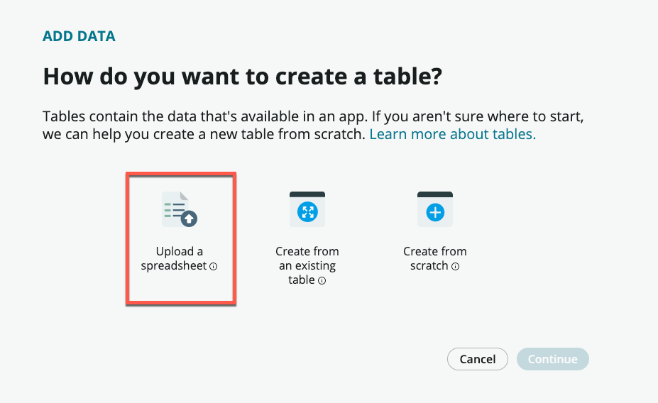

1. Click **Continue**

1. Download this file: [airports.xlsx](https://github.com/shaoservicenow/travelrequest/raw/main/docs/downloads/airports.xlsx "download")

1. Upload the downloaded file to the upload box. You should see the following screen once the upload is successful

    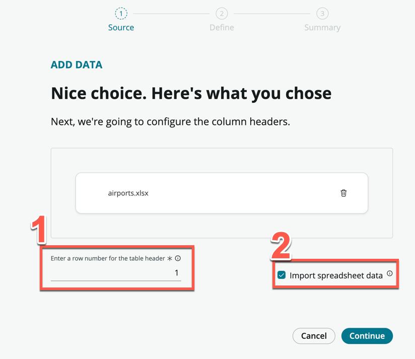

1. ***IMPORTANT***: Make sure to check the **Import spreadsheet data** box.

1. Click **Continue**

1. After a short loading time, you should land on the page that says: "Great! Here's the info we brought over from your spreadsheet"

    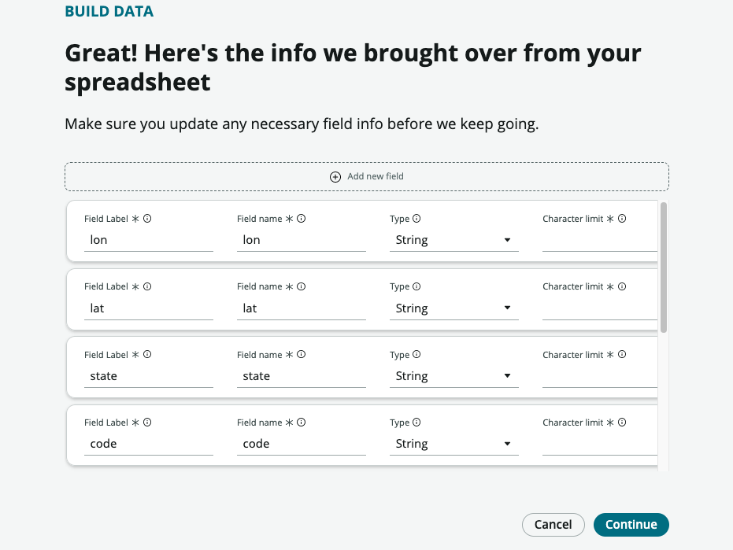

1. Scroll through the list to see all the fields that will be created. Notice that you can change the data **Type** if necessary, but we can leave everything as String fields for now

1. Click **Continue**

1. Under **Table label**, enter **Airport**. **Table name** will be automatically populate, leave it as it is

1. Check **Auto number**, leave the Prefix as it is

    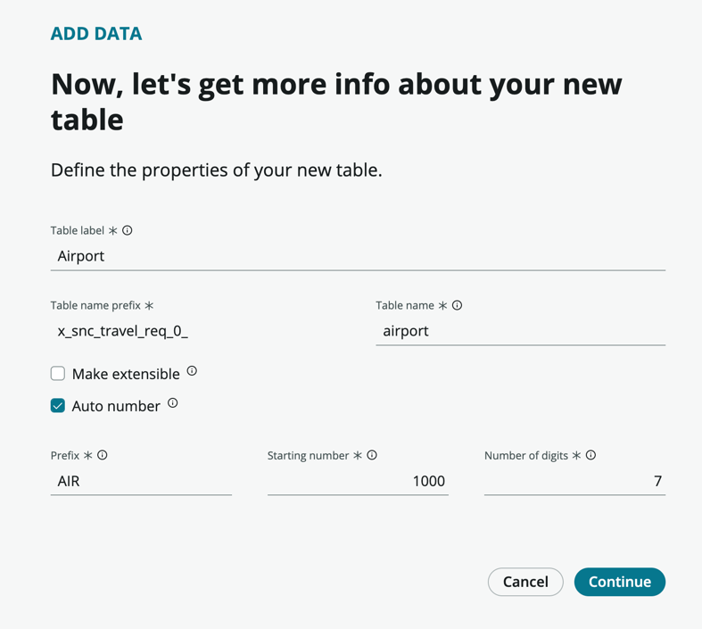

1. Click **Continue**

1. In the roles page, check **All** for *admin*, and only **Read** for *user*

    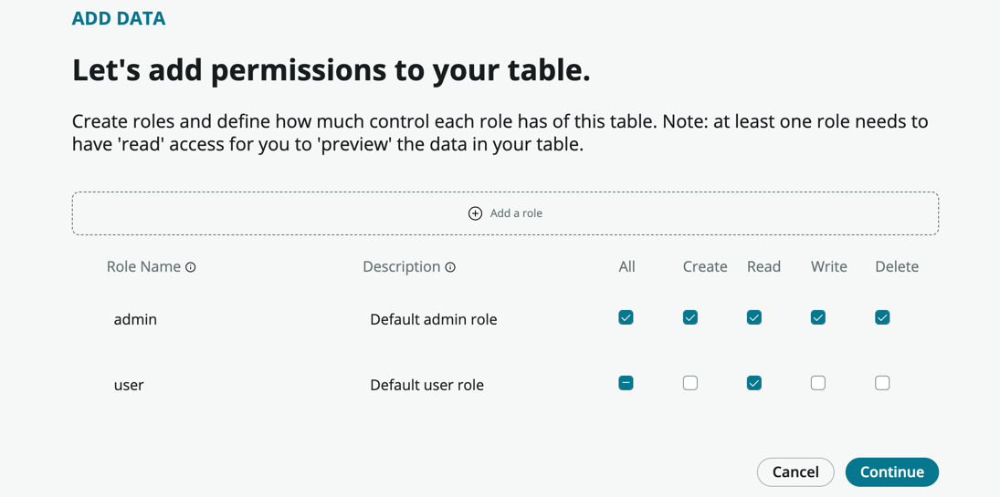

1. Click **Continue**

1. Click **Edit table**

1. On the table editor, toggle **Display** on the **Name** row. This is what users will search for when selecting airports

    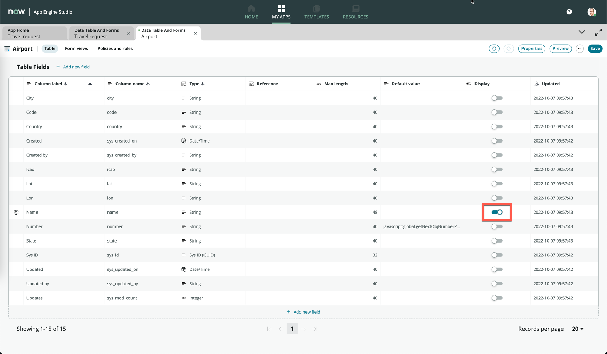

1. Click **Save** on the top right of the screen

1. Click **Preview**

1. A new tab should open and show you the list of airports you have imported. Notice that there are 100 airports imported as per our excel spreadsheet. 
  
    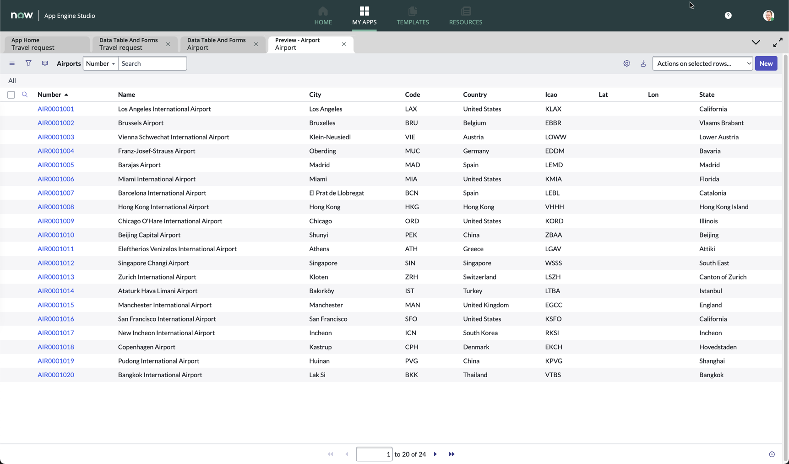

    > In case you were wondering, the Lat and Lon fields are deliberately left empty. In the optional bonus exercise, we will use an API to get these values, but has no impact on our exercises.

Great, you now have a table to store the list of Airports!

## Completing the Travel request table

1. If the **Travel request** tab is still open, click to navigate to it

    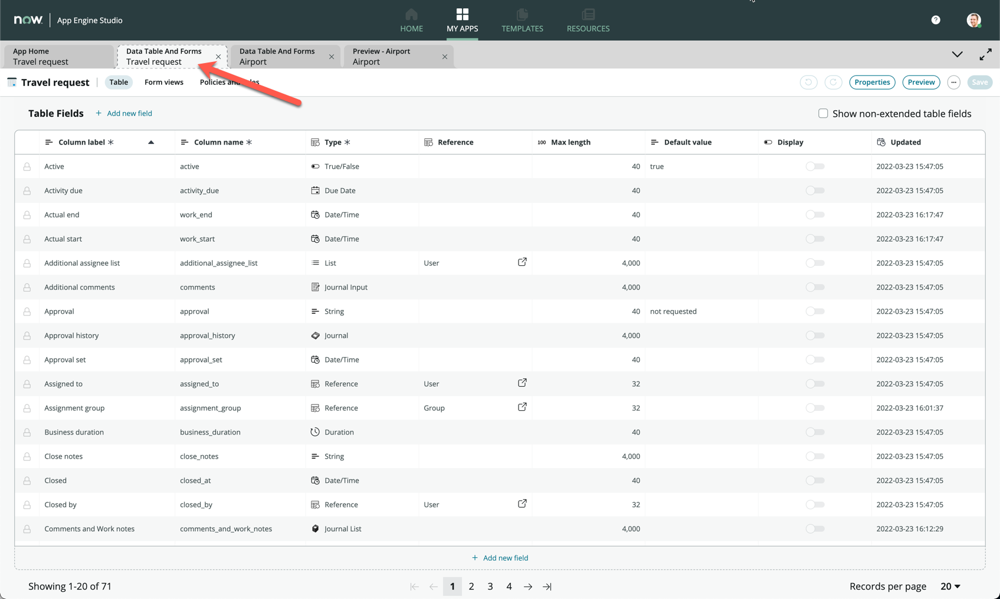

1. If not, return to **App Home** and open the **Travel request** table

1. Click **Add new field**, and add the following fields:

    Column label | Type
    -------------- | --------------
    Travel from | Reference (Airport)
    Travel to | Reference (Airport) 

    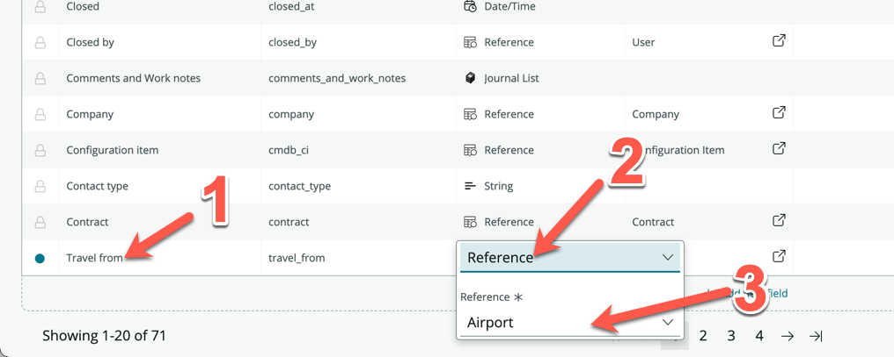

1. It should look like the following once you've added the two new fields

    

1. Click **Save**

    > For simplicity, we are not adding additional fields like Daily estimated expenses, etc. You can always choose to add those fields if you want to.

## Styling the backend form

1. Still in the table designer, click **Form views**

    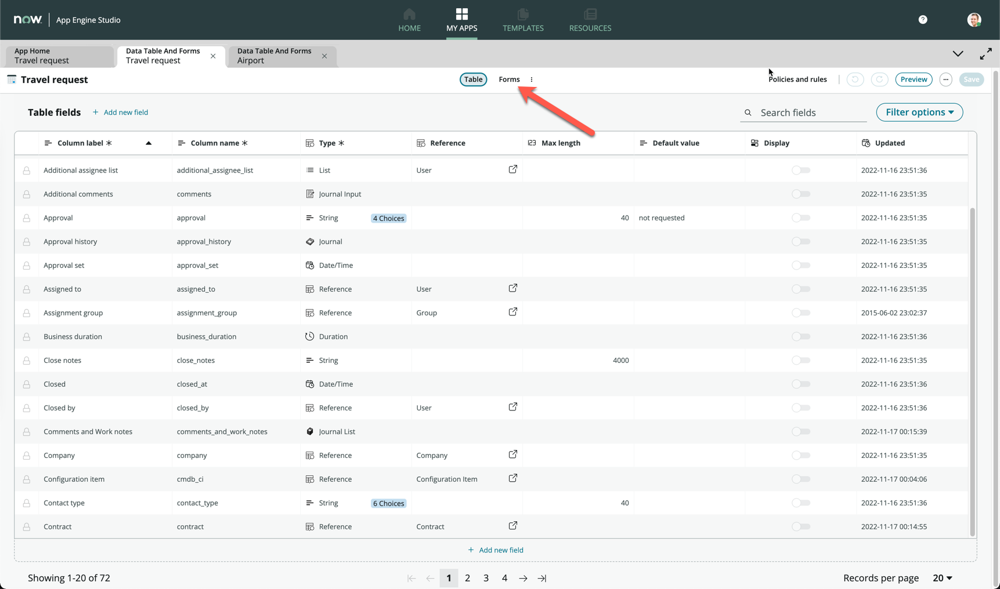

1. Remove the following fields from the screen by clicking the **X** icon

    - Assigned to
    - Configuration item
    - Priority
    - Parent
    - Active

     

    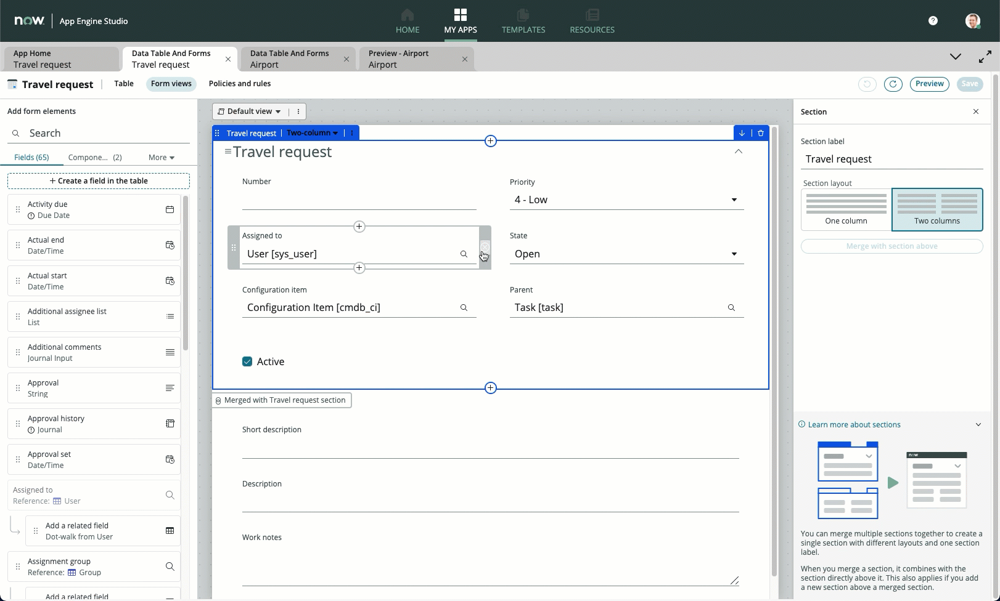

1.  These fields are inherited from the task table, and are not needed for the purposes of our application.

1. From the left sidebar, search and drag in the following fields onto the form views

    - Reason for travel
    - Opened by
    - Travel from
    - Travel to
    - Departure date
    - Return date
    - Estimated airfare

     

    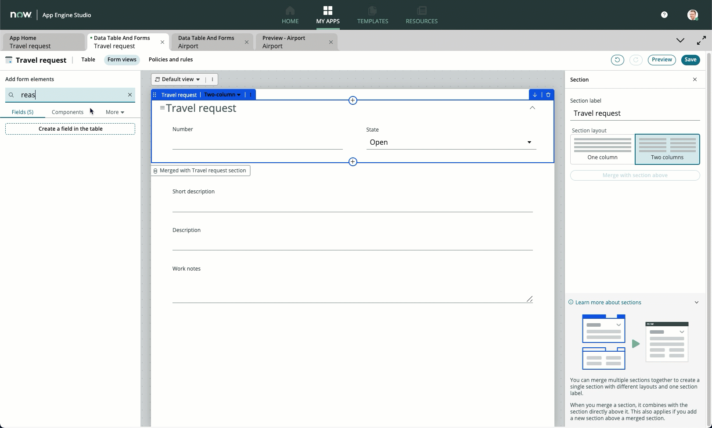

1. When completed, your form view should look similar to this

    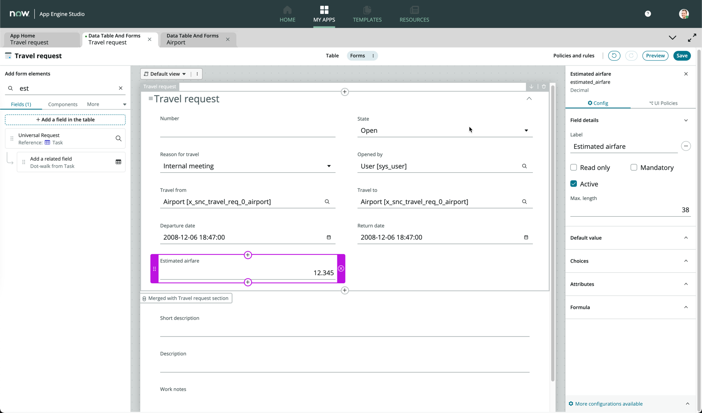

1. Click **Save**

Congratulations, you have completed Exercise 1 and now have a complete way to store the Travel requests from your employees.

 

[Next exercise](https://shaoservicenow.github.io/travelrequest/docs/Exercise%202.html){: .btn .btn-purple }